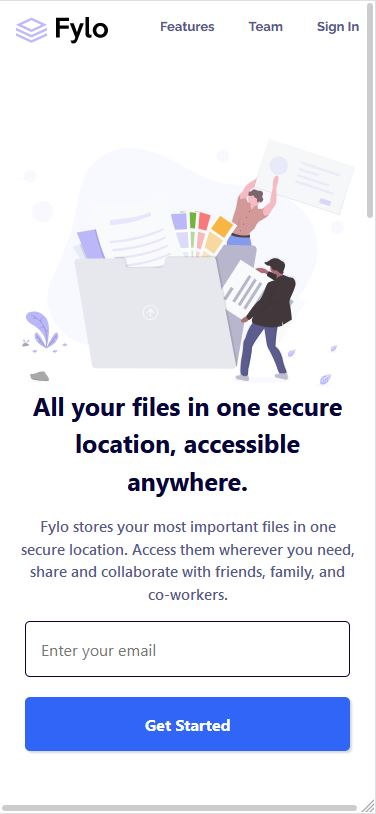
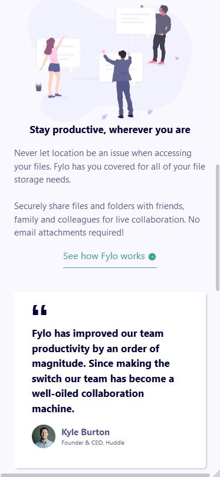
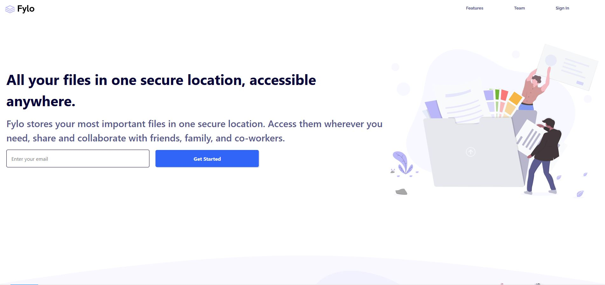
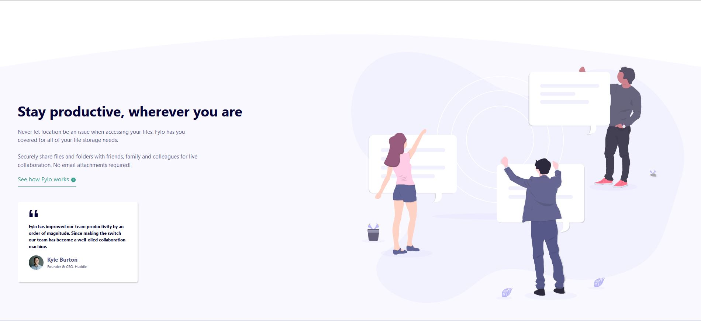
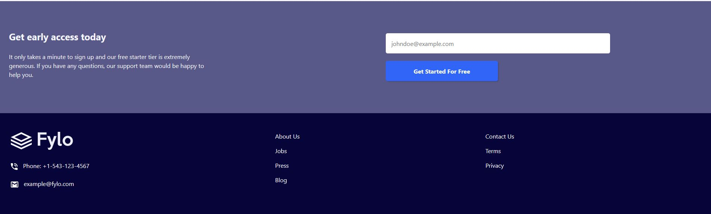

# Frontend Practice 

This repository is going to help me keep track of all the challenges I complete from Frontend Mentor(https://www.frontendmentor.io). These challenges are designed to help improve my skills by building realistic web pages. 

## Table of contents
- [Overview](#overview)
- [Completed](#completed)
    - [Fylo Landing Page](#fylo-landing-page)
        -[Mobile](#fylo-mobile)
        -[Desktop](#fylo-desktop)

## Overview 

I will include all my completed challenges under the [Completed](#completed) tab. Each completed project will include at least two screenshots, one that will show the how the web page looks on small devices such as mobile devices. The other screenshot will show how it looks on a desktop. 

## Completed

### Fylo Landing Page

#### Mobile 

#### Desktop

