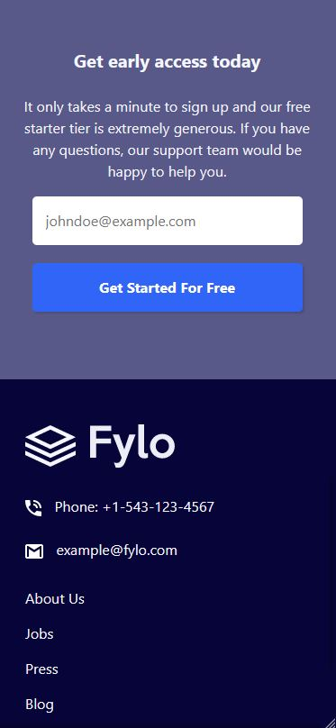
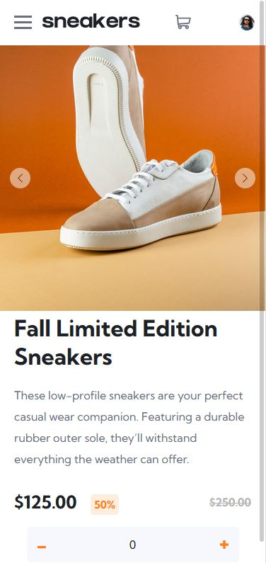
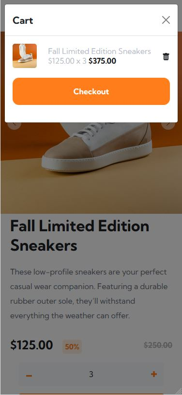
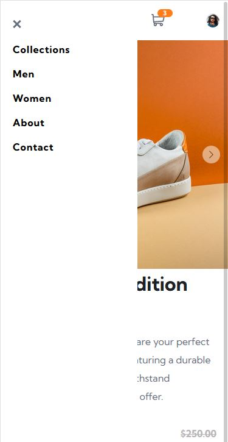
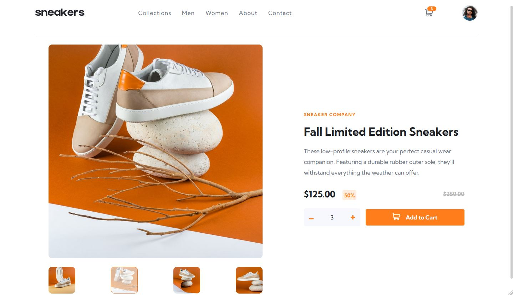
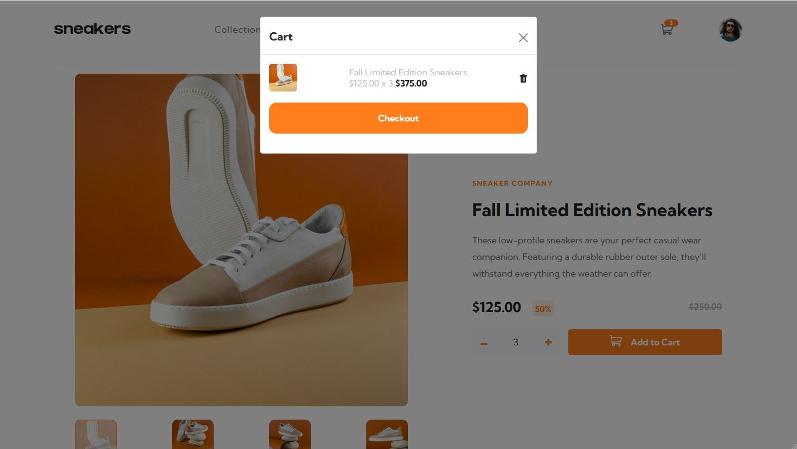

# Frontend Practice 

This repository is going to help me keep track of all the challenges I complete from [Frontend Mentor](https://www.frontendmentor.io). These challenges are designed to help improve my skills by building realistic web pages. 

## Table of contents
- [Overview](#overview)
- [Completed](#completed)
    - [Fylo Landing Page](#fylo-landing-page)
    - [Chat App](#chat-app)
    - [E-Commerce](#e-commerce)

## Overview 

I will include all my completed challenges under the [Completed](#completed) tab. Each completed project will include at least two screenshots, one that will show the how the web page looks on small devices such as mobile devices. The other screenshot will show how it looks on a desktop. 

All challenges were completed with the design idea of [mobile first](https://medium.com/@Vincentxia77/what-is-mobile-first-design-why-its-important-how-to-make-it-7d3cf2e29d00).

## Completed

### Fylo Landing Page

This challenge was to make a simple landing page for the imaginary Fylo company. I was given the assets such as the illustrations seen and the background svgs. The real challenge was to make the page responsive and making sure everything looked desirable on mobile and desktop.

Designs created for the follow widths:
375px - Mobile
1440px - Desktop

Tools/Technology used:
HTML5
CSS3
#### Mobile 

#### Desktop

### Chat App

With this challenge, the only assets I was given was the avatar and dog images. The real challenge was to create everything else using CSS. The background, phone, messages, basically everything besides the images was created using vanilla CSS.

Designs created for the follow widths:
375px - Mobile
1440px - Desktop

Tools/Technology used:
HTML5
CSS3
### Mobile 

### Desktop

### E-Commerce 

This was an especially difficult challenge that tested my JS skills. With this challenge, I decided to use the React.js framework in order to make the different components such as the checkout modal, navbar, etc. What made this difficult was passing the information from one component to another when adding items to the cart. In all, this was a super fun challenge, and I am glad of the outcome!

I was so glad with how it turned out, I deployed it to github pages! Click [here](https://cbonoan.github.io/eCommerceProject/) to see it. 😄

Tools/Technology used:

HTML5

CSS3

JS

React

Github Pages
### Mobile

### Desktop 

